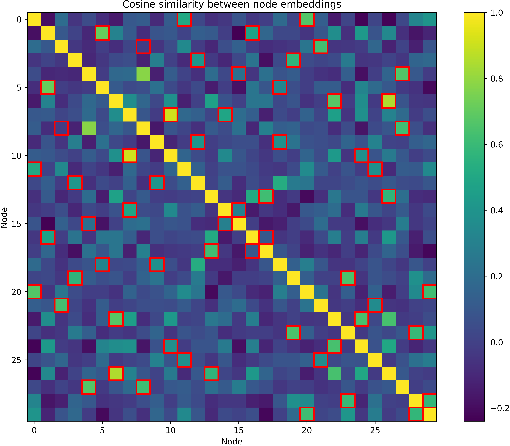
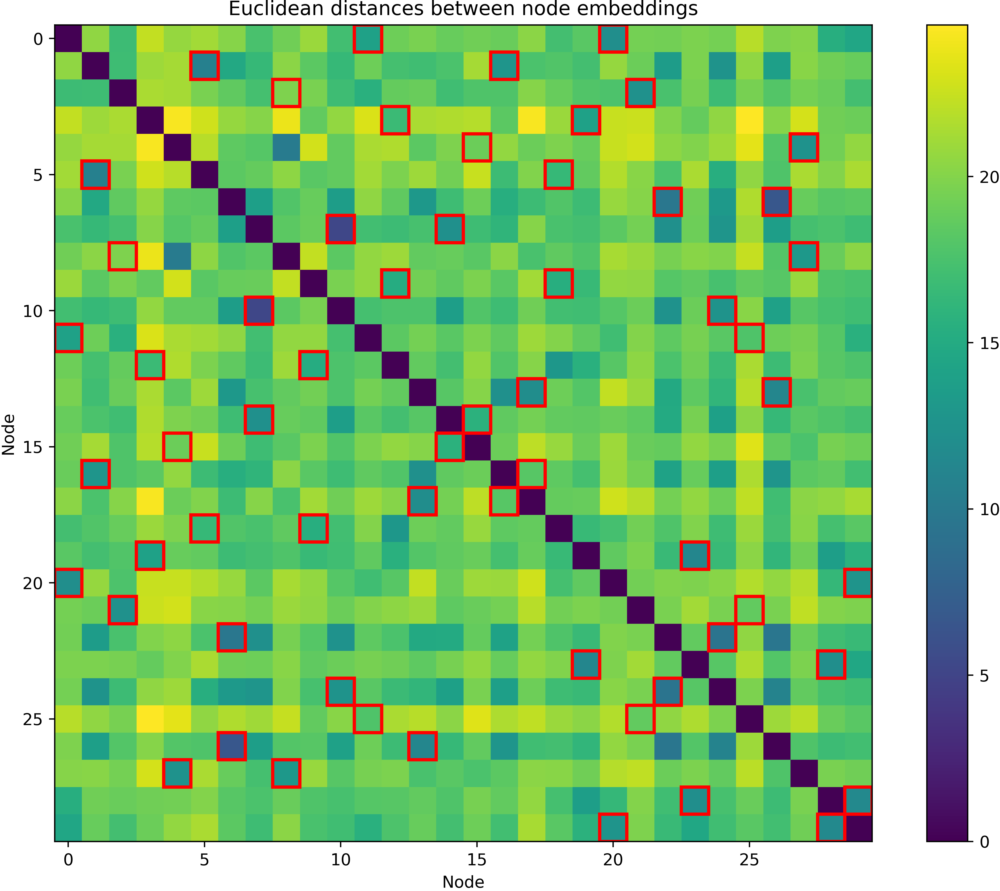
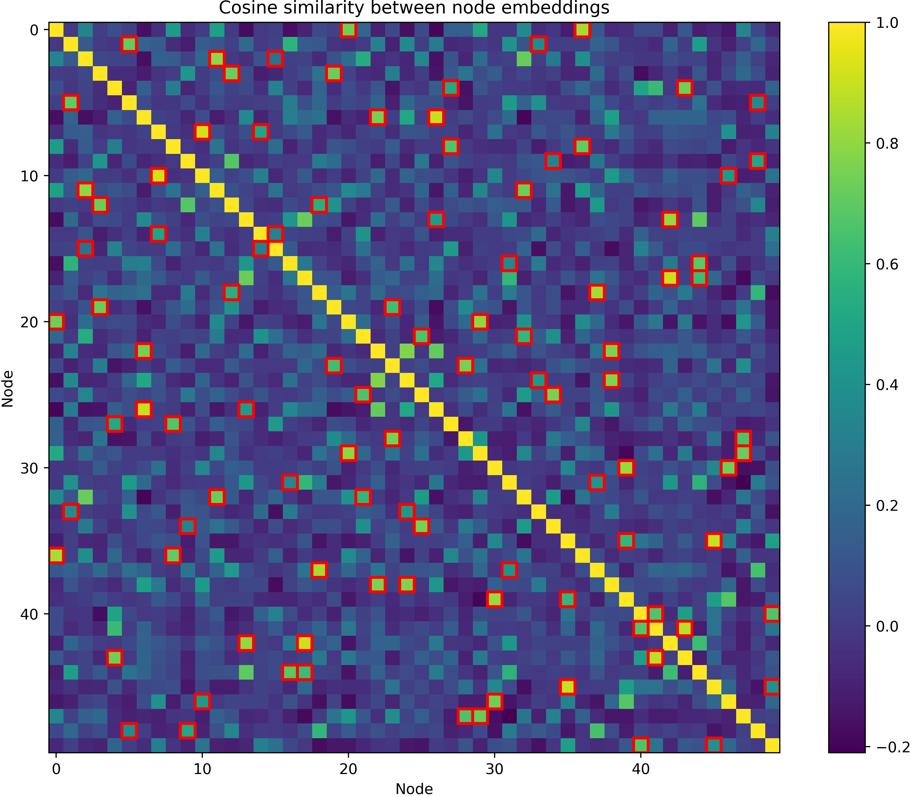
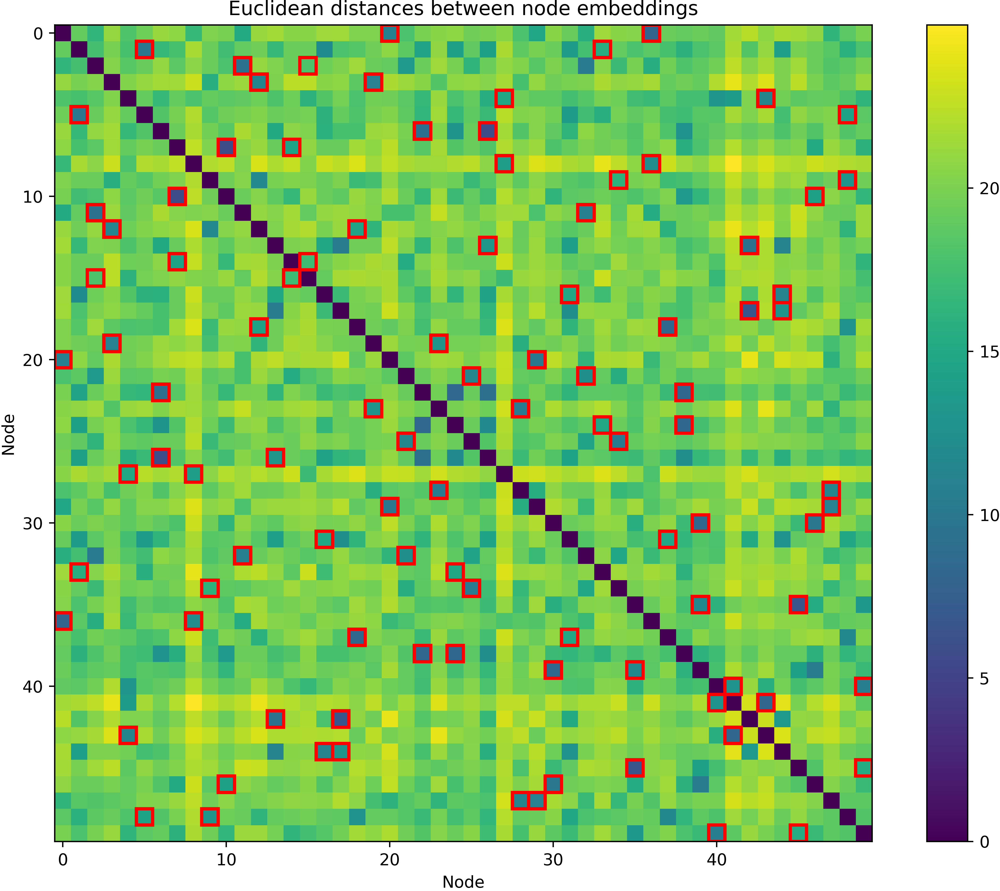
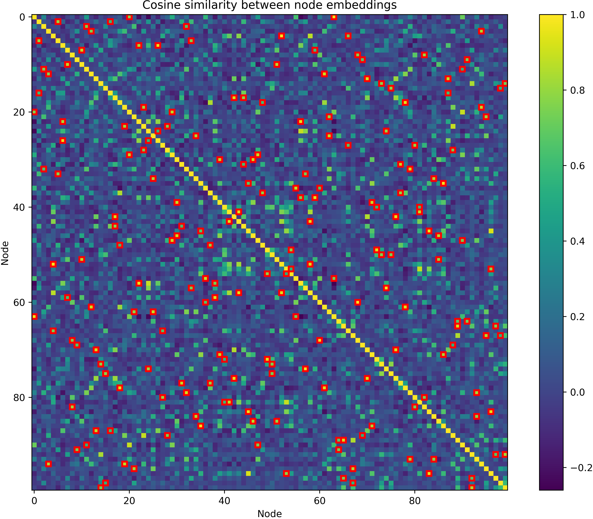
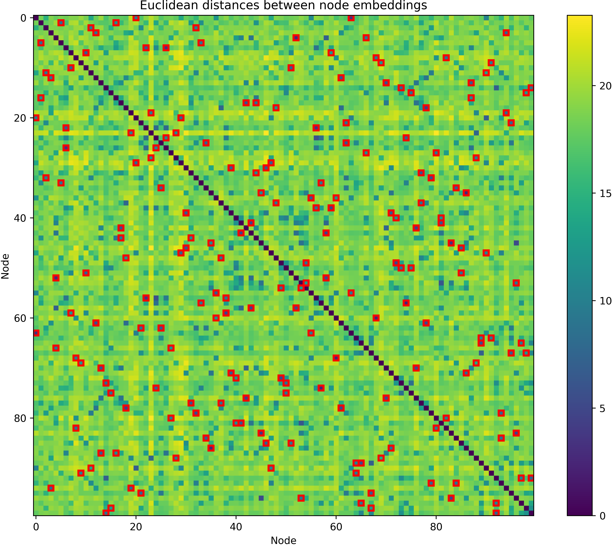

# Graph Edge Attention Network (GREAT)

This repository contains code to train novel neural architectures called Greaph Edge Attention Network (GREAT) to solve the Traveling Salesman Problem (TSP), Capacitated Vehicle Routing Problem (CVRP) and Orienteering Problem (OP) on different data distributions (Euclidean and asymmetric distances).
For a detailed background, check our paper [A GREAT Architecture for Edge-Based Graph Problems Like TSP](https://arxiv.org/abs/2408.16717)

```
@misc{lischka2025greatarchitectureedgebasedgraph,
      title={A GREAT Architecture for Edge-Based Graph Problems Like TSP},
      author={Attila Lischka and Filip Rydin and Jiaming Wu and Morteza Haghir Chehreghani and Balázs Kulcsár},
      year={2025},
      eprint={2408.16717},
      archivePrefix={arXiv},
      primaryClass={cs.LG},
      url={https://arxiv.org/abs/2408.16717},
}
```


## Getting started

Install the packages listed in `requirements.txt`.
You will defenitely require pytorch, pytorch geometric and numpy.

Install LKH-3 from [here](http://webhotel4.ruc.dk/~keld/research/LKH-3/).
If the GREAT repository is located in `home/GREAT` copy the LKH-3 code to `home/lkh_wrapper`.
Then, copy the script `tour_wrapper.py` into `home/lkh_wrapper` aswell.
`tour_wrapper.py` contains a python wrapper function that is used to call the LKH-3 heuristic in a subprocess. This is important when producing targets in supervised learning settings for optimal TSP edge classification and when evaluating the TSP RL models to compare them to a baseline.
Further, for running OP benchmarks, it is necessary to install the op-solver from [here](https://github.com/gkobeaga/op-solver). We followed the instructions of the docker install and our code wrapper is based on this.

## Train a new model

You can train new GREAT models by using the `train.py` script.
The hyperparameters of the model that shall be trained can be set in the `config_files/config.yaml` file.

E.g., use the following config to train a GREAT model to generate Euclidean TSP solutions:

```yaml
num_layers: 5
hidden_dim: 128
heads: 8 # attention heads
instance_size: 50 # number of cities/nodes in the routing problem instance
problem: TSP # TSP, CVRP, OP
dataset_size: 2000
batch_size: 50
epochs: 20
num_datasets: 1 ### use num_datasets many different datasets for training (use a different one each epoch)
task: RL # tour, cost or RL
lr: 0.0001 # learning rate
scale_weights: true # scale loss in tour task, as there are much fewer optimal edges than non-optimal edges
data_distribution: EUC ### EUC (euclidean), XASY (extreme asymmetric), TMAT (asymmetric but triangle inequality holds), MIX (the other three distributions mixed)
final_node_layer: false # an optional, final node nevel GNN layer in the RL case (as we need node embeddings for the decoder)
nodeless: true # completely node-less GREAT (not even temporary node variables for aggregation)
augmentation_factor: 8 # specifies by which factor data is augmented in the RL case (1 means no augmentation)
matnet: false # use MatNet instead of GREAT layers
```

Similarly, configs for OP and CVRP can be created.

## Trained Models

We also provide trained models in the `final_models` folder. We provide models that have been trained using RL and can be used to directly construct TSP, CVRP and OP tours.

The RL models are located in `final_models/TSP_RL`, `final_models/CVRP_RL` and `final_models/OP_RL` and can be tested running the `benchmarking_RL.py` script by specifying the config of the desired model.
We also provide the optimal or heuristic solutions to test datasets in these folders that were obtained using the Gurobi solver (TSP), [HGS](https://github.com/chkwon/PyHygese) (CVRP) and [EA4OP](https://github.com/gkobeaga/op-solver) (Euclidean OP).

## Visualize the RL learning process

Visualize the similarity of the node-embeddings generated by the GREAT-encoder that are passed to the decoder in the RL setting by running `visualize_learning.py`.

<div style="text-align: center;">
    <table style="margin: auto;">
        <tr>
            <td></td>
            <td></td>
        </tr>
        <tr>
            <td></td>
            <td></td>
        </tr>
        <tr>
            <td></td>
            <td></td>
        </tr>
    </table>
</div>

## Acknoledgements

Thanks to [Pointerformer](https://github.com/Pointerformer/Pointerformer). We adapted the decoder for our RL framework from this repository aswell as parts of the overall RL pipeline. We also used the [MatNet](https://github.com/yd-kwon/MatNet/tree/main/ATSP/ATSP_MatNet) architecture and code for benchmarking, as well as code from [POMO](https://github.com/yd-kwon/POMO/tree/master) to develop the RL environments for CVRP and OP.
